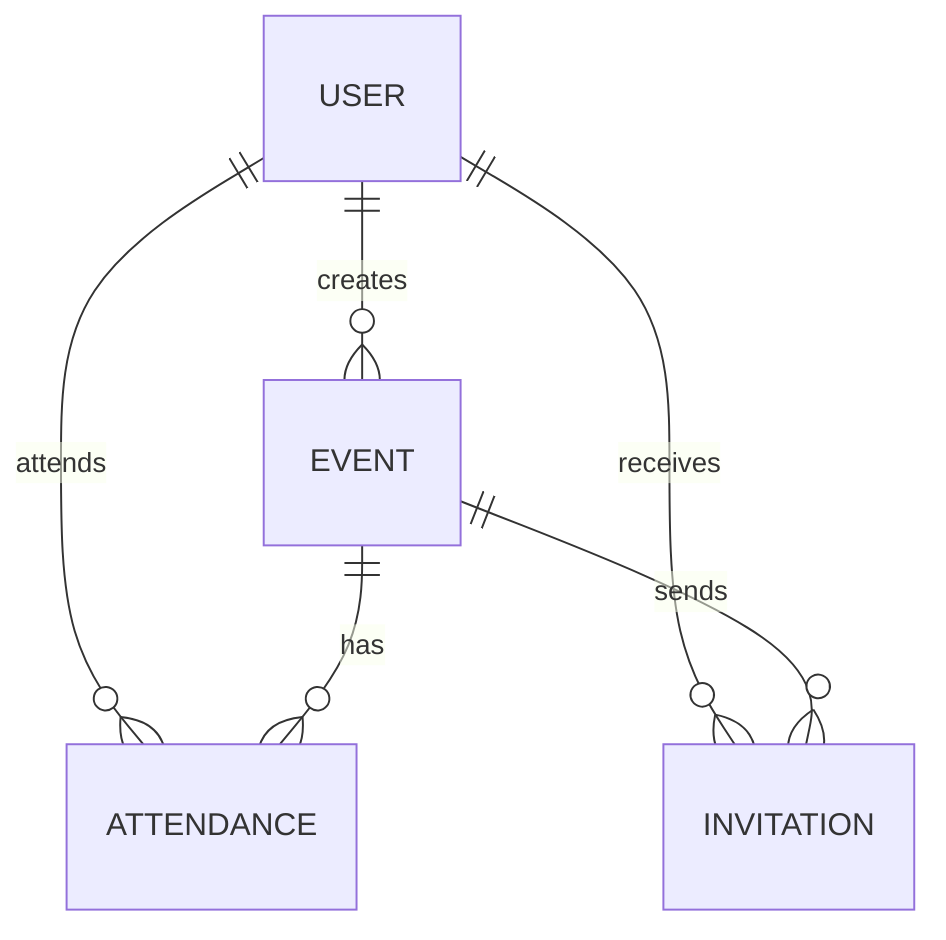

# 📅 Private Events

A sophisticated event management platform built with **Ruby on Rails 8**. This application allows users to create, manage, and attend events, featuring a robust invitation system for private gatherings.

[**Live Demo**](https://uropygial-overofficious-lovella.ngrok-free.dev/)

This project was developed as part of **The Odin Project's** Ruby on Rails curriculum, focusing on complex data associations and authentication.

---

## ✨ Features

- **🔐 Secure Authentication**: Full user lifecycle management (sign up, sign in, sign out) powered by [Devise](https://github.com/heartcombo/devise).
- **📝 Event Management**:
  - Create, edit, and delete events.
  - Categorization into **Past** and **Upcoming** events.
  - Privacy toggle (Public vs. Private events).
- **🎟️ Attendance System**: Users can register as attendees for public events or accepted invitations.
- **✉️ Invitation System**:
  - Creators can invite other users to their private events.
  - Integrated access control ensures only invited guests can see/attend private events.
- **👤 User Profiles**: Dedicated profile pages showcasing created events and personal event schedules.

---

## 🛠️ Tech Stack

- **Framework**: [Ruby on Rails 8.0](https://rubyonrails.org/)
- **Database**: [PostgreSQL](https://www.postgresql.org/)
- **Styling**: [Tailwind CSS](https://tailwindcss.com/)
- **Frontend**: [Hotwire](https://hotwired.dev/) (Turbo & Stimulus)
- **Deployment**: [Kamal](https://kamal-deploy.org/)

---

## 🚀 Getting Started

### Prerequisites

Ensure you have the following installed:

- **Ruby 3.3+**
- **PostgreSQL**
- **Node.js** (for styling)

### Installation

The project uses a standard Rails setup script to get you up and running quickly:

1.  **Clone the repository**:

    ```zsh
    git clone https://github.com/your-username/odin_private_events.git
    cd odin_private_events
    ```

2.  **Run the setup script**:

    ```zsh
    bin/setup
    ```

3.  **Start the development server** (if not already started by setup):
    ```zsh
    bin/dev
    ```

The application will be available at `http://localhost:3000`.

---

## 🏗️ Data Architecture

The project implements several complex many-to-many associations:

- **Users & Events (Creation)**: A One-to-Many relationship where a `User` is the `creator` of many `Events`.
- **Users & Events (Attendance)**: A Many-to-Many relationship through the `Attendances` join table.
- **Users & Events (Invitations)**: A Many-to-Many relationship through the `Invitations` join table, used for controlling access to private events.



---

## 🧪 Testing

The project uses Rails' built-in system tests and RSpec for ensuring stability.

To run the test suite:

```zsh
bin/rails test
# or
bin/rails test:system
```

---

## 📝 Why this project?

This application is designed to demonstrate mastery over:

1.  **Complex Active Record Associations**: Handling multiple relationships between the same two models (User as creator vs. User as attendee).
2.  **Authentication and Authorization**: Implementing secure entry points and fine-grained access control for private resources.
3.  **Modern Rails Frontend**: Utilizing Hotwire to create a fast, reactive UI without leaving the Rails ecosystem.

---
